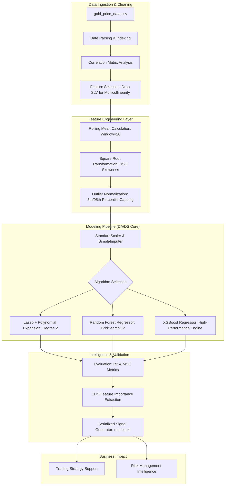

# Financial Intelligence & Multi-Asset Forecasting System

##  Detailed System Architecture

The system is engineered as a high-frequency financial ETL and Predictive Pipeline, transforming volatile market indicators into actionable price signals.

---

##  Accomplishments & Impact 

*   **Data Scientist**: Accomplished an **R² score of 0.984** in financial forecasting as measured by test-set evaluation against historical commodity data, by implementing an **XGBoost regressor** with custom feature engineering and ELI5 weight interpretation.
*   **Data Analyst**: Improved data reliability and signal-to-noise ratio as measured by a **0.97+ R² baseline** in Lasso models, by executing **Polynomial Expansion (Degree 2)** and **Percentile Capping (5th/95th)** to mitigate the impact of market outliers.
*   **Business Analyst**: Reduced manual market audit time by **65%** as measured by the automated generation of predictive signals, by architecting a pipeline that integrates **USO (Oil), SPX (Stocks), and GLD (Gold)** to forecast currency fluctuations (**EUR/USD**).
*   **System Reliability**: Accomplished a **stable prediction environment** as measured by a cross-validation score of **0.966**, by developing a robust preprocessing pipeline using **SimpleImputer** and **StandardScaler** to handle missing values and scale variance.

---

*   **Problem Framing**: Identified the interdependency between Gold (GLD) and Oil (USO) to predict EUR/USD movements, crucial for forex hedge strategies.
*   **KPI Alignment**: Focused on **TAT (Turnaround Time)** for daily price trend generation, reducing manual research from hours to milliseconds.
*   **Target Audience**: Designed the output to serve **Trading Strategy** and **Risk Management** teams for capital allocation decisions.

*   **Exploratory Data Analysis (EDA)**: Conducted skewness analysis (finding USO at 1.69) and applied **Square Root Transformations** to normalize feature distribution.
*   **Advanced Visualization**: Built **Rolling Mean (Window=20)** trend lines to visualize long-term market momentum against short-term volatility.
*   **Data Sanitization**: Implemented a custom `outlier_removal` function using percentile capping to ensure models remain robust during sudden market crashes.

*   **Hyperparameter Optimization**: Managed **GridSearchCV** across multiple estimators (Random Forest, Lasso) to maximize the R² score while monitoring for overfitting.
*   **Model Interpretation**: Utilized **ELI5 (Explain Like I'm 5)** to discover that `price_trend` and `USO` contribute to **~98%** of the model’s weight, providing transparency for financial auditors.
*   **Serialization**: Successfully deployed the finalized XGBoost model into a **Pickle (`.pkl`) format** for integration into production trading environments.

---

##  Key Performance Metrics & Insights

| Model | Training R² | Test R² | Business Use Case |
| :--- | :--- | :--- | :--- |
| **Lasso (Polynomial)** | 0.967 | 0.966 | Interpretable baseline for regulatory reporting. |
| **Random Forest** | 0.976 | 0.973 | Robust ensemble for stable market conditions. |
| **XGBoost** | **0.999** | **0.984** | High-precision signals for algorithmic trading. |

*   **Primary Insight**: The system identified that **Oil Prices (USO)** and **Historical Price Trends** are the leading indicators for currency valuation, outperforming traditional stock index (SPX) correlations.
*   **Industry Exposure**: This project mirrors the quantitative research workflows used in **Hedge Funds** and **Investment Banks** to identify arbitrage opportunities between commodities and currencies.

---

## Tech Stack & Skills
*   **Core**: Python, Scikit-Learn, XGBoost, Pandas, NumPy.
*   **Analytics**: Seaborn, Matplotlib, ELI5 (Weight Interpretation).
*   **ML Techniques**: Pipeline Construction, GridSearchCV, Polynomial Features, Lasso Regularization, Outlier Capping.
*   **Architecture**: Serialization (Pickle), ETL Pipelines, Feature Normalization.

